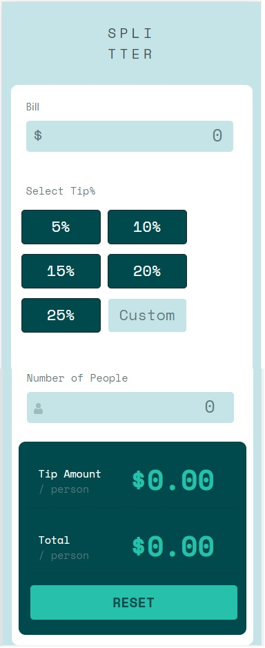

# Frontend Mentor - Tip calculator app

This is a solution to the [Order summary card challenge on Frontend Mentor](https://www.frontendmentor.io/challenges/order-summary-component-QlPmajDUj). Frontend Mentor challenges help you improve your coding skills by building realistic projects.

## Table of contents

- [Overview](#overview)
  - [The challenge](#the-challenge)
  - [Screenshot](#screenshot)
  - [Links](#links)
  - [Built with](#built-with)
  - [What I learned](#what-i-learned)
- [Author](#author)

## Overview

### The challenge

Users should be able to:

- View the optimal layout for the app depending on their device's screen size
- See hover states for all interactive elements on the page
- Calculate the correct tip and total cost of the bill per person

### Screenshot

### Links

- Solution URL: (https://github.com/MaqsudMallick/tip-calculator/)
- Live Site URL: (https://maqsudmallick.github.io/tip-calculator/)

### Built with

- Semantic HTML5 markup
- CSS custom properties
- Bootstrap 5
- Javascript
- Jquery
- Google Fonts

### What I learned

-toggling between different buttons
-refreshing the page with location.reload()
-stopping event bubbling with event.stopProgresion()
-using visibility property to toggle visibiltiy of class

## Author

Frontend Mentor - [@MaqsudMallick](https://www.frontendmentor.io/profile/MaqsudMallick)
